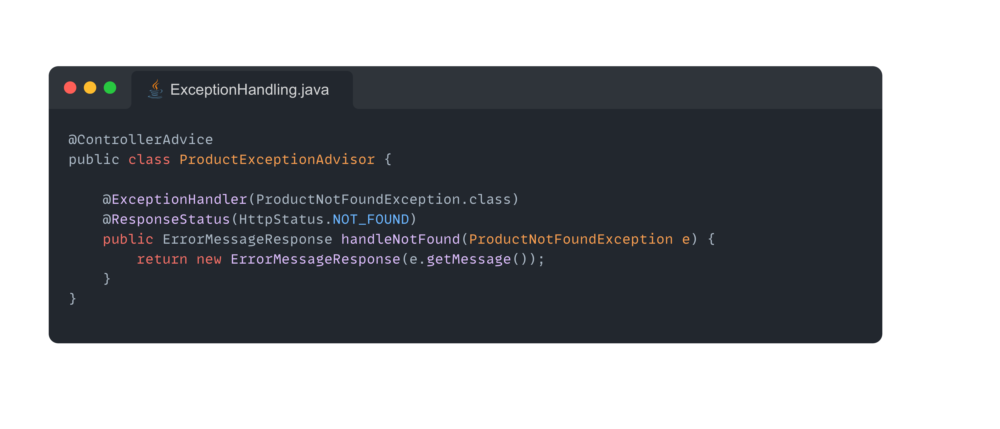
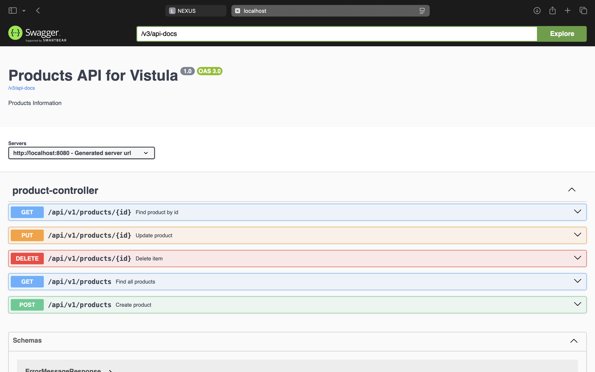
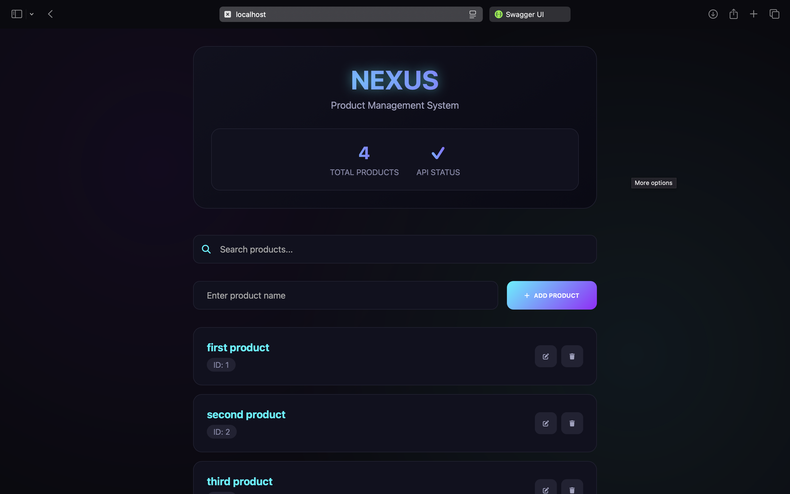
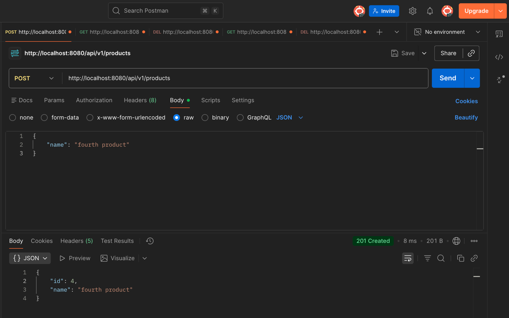
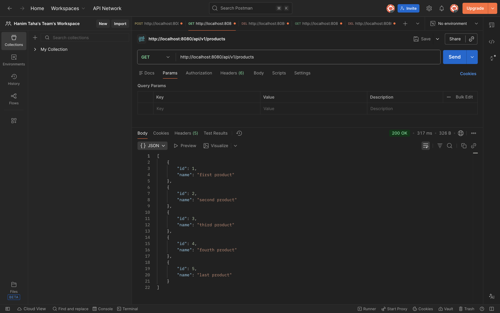
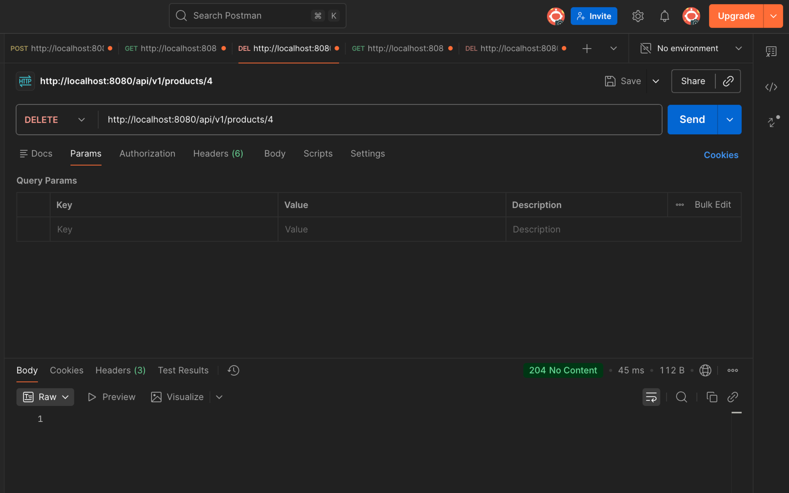
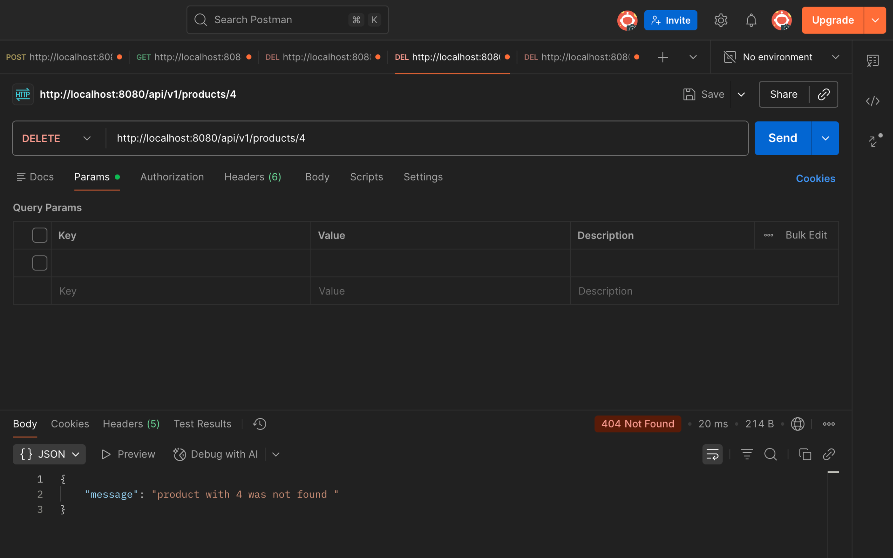
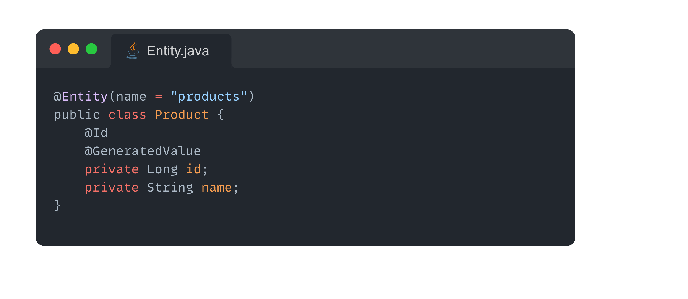
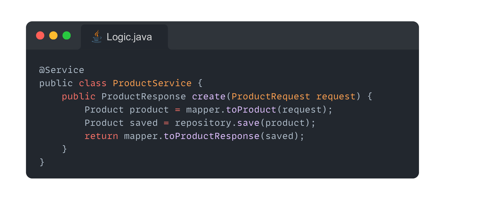
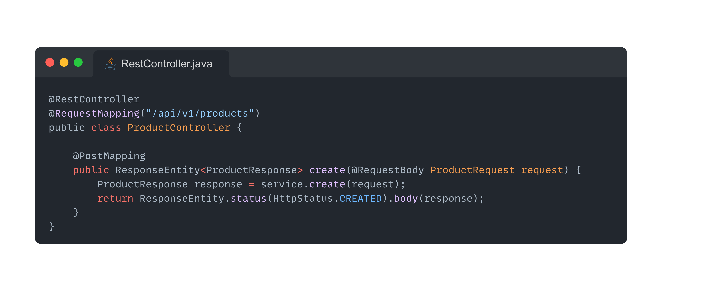

# 🎓 Spring Boot REST API – University Project

> **Akademia Finansów i Biznesu Vistula**  
> A complete **Spring Boot CRUD REST API** demonstrating professional backend development practices.

---

## 📌 Project Overview

This project is a **fully functional REST API** built with **Spring Boot** as part of my university coursework.  
It demonstrates **CRUD operations**, clean **layered architecture**, professional **exception handling**, and **API documentation** using industry-standard tools.

---

## 🧱 Architecture & Technologies

### 🔧 Architecture
- Layered Architecture: **Controller → Service → Repository**
- RESTful API design
- DTO-based communication
- Centralized exception handling

### 🛠️ Tech Stack
- **Java**
- **Maven**
- **Spring Boot**
- **Spring Data JPA**
- **H2 Database**
- **Swagger / OpenAPI**

---

## 🚀 Features

### ✅ CRUD Operations (Products API)

| Method | Endpoint | Description |
|------|--------|------------|
| POST | `/api/v1/products` | Create a new product |
| GET | `/api/v1/products` | Retrieve all products |
| GET | `/api/v1/products/{id}` | Retrieve product by ID |
| PUT | `/api/v1/products/{id}` | Update an existing product |
| DELETE | `/api/v1/products/{id}` | Delete a product |

---

## 🗄️ Database Integration

- **H2 in Memory Database**
- Automatic schema generation from entities
- Spring Data JPA repositories

### 📍 H2 Console Access

---

## 🛡️ Error Handling

- Custom exception: `ProductNotFoundException`
- Global exception handling using `@ControllerAdvice`
- Consistent and meaningful error responses
- Proper HTTP status codes:
    - **404** – Not Found
    - **400** – Bad Request
    - **500** – Internal Server Error

---

## 📄 API Documentation

Interactive API documentation powered by **Swagger / OpenAPI**.

- **Swagger UI**  
  👉 `http://localhost:8080/swagger-ui/index.html`

- **OpenAPI JSON**  
  👉 `http://localhost:8080/v3/api-docs`

---

## 🧪 Running & Testing the Application

### ▶️ the Application interface
<h2>This is a small Front-end page that's linked to the whole project where you can see and edit the products</h2>

---

## 🧩 **PostMan:**

## 📦 **PostMan: Post**

---

## 🧪 **PostMan: Get**

---

## 📄 **PostMan: Delete**

---

## ⭐ **PostMan: ExceptionHandling**

---

## 🧩 **Code Structure**

### 📦 Entity Layer
Represents the database model and defines JPA mappings used by Hibernate.

---

### ⚙️ Service Layer (Business Logic)
Contains application business logic and acts as a bridge between controllers and repositories.

---

### 🌐 REST Controller Layer
Exposes REST endpoints, handles HTTP requests, and returns appropriate HTTP responses.

---

### 🌐 REST Controller Layer
Exposes REST endpoints, handles HTTP requests, and returns appropriate HTTP responses.

---
## 🧠 What I Learned

### 📚 Core Concepts
- REST API design principles  
- Layered architecture & separation of concerns  
- Mapper patterns  
- Global exception handling  
- Database integration using JPA & Hibernate  
- API documentation with Swagger  

### 🧑‍💻 Technical Skills
- Java 17 features  
- Spring annotations (`@RestController`, `@Service`, `@Repository`)  
- Dependency Injection  
- Maven build automation  
- JSON serialization / deserialization  
- In-memory database management  

---

## ✨ Answer to question is section 2.G
<h3>Those methods already exists in the JPARepo so we dont need to write them because spring data jpa provides them automatically</h3>

---

## ✨ Final Notes

This project reflects **real-world backend development practices** and serves as a solid foundation for building scalable Spring Boot applications.

---

## 🎓 **Project Submission**

**Student:** [Taha Hanim] 
**University:** Akademia Finansów i Biznesu Vistula  

### 📧 **Contact Information**
**Email:** [thanim1@stu.vistula.edu.pl]  
**GitHub:** [Taha-Hanim](https://github.com/Taha-Hanim)

---

*This project represents my journey in mastering JAVA, Spring Boot and REST API development*

---

🔗 **Repository:** [https://github.com/Taha-Hanim/MyGitRepo](https://github.com/Taha-Hanim/MyGitRepo)  
📅 **Submission Date:** December 2025  
👨‍🏫 **Professor:** mgr inż. Dominik Bielecki

